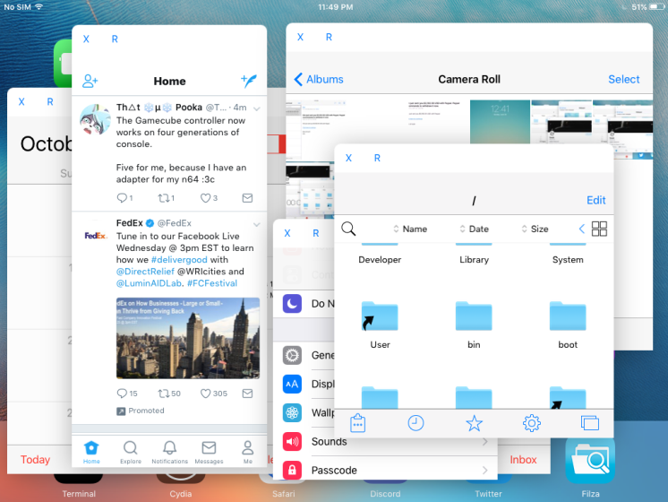

# iOS-MultiWM

Abandoned due to more recent versions of iOS coming with more robust multitasking solutions. 

Dissident must be used to keep apps alive while they are displayed in windows
Touch keyboard input for windowed apps is not currently supported. Bluetooth keyboard input will work.
This tweak works well when paired with BTCMouse&Trackpad.
Opening a window is done with a user set Activator gesture.
This tweak requires activator and rocketbootstrap.

